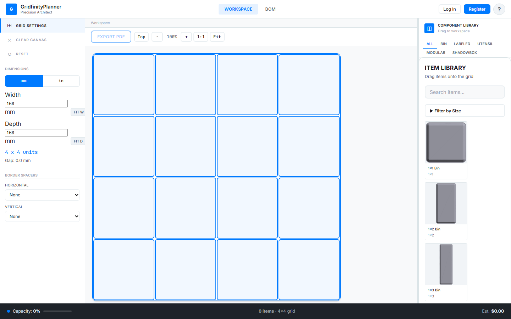

# Ordinus

A web-based visual layout tool for planning [Gridfinity](https://www.printables.com/model/274917-gridfinity-specification) modular storage systems. Drag bins onto a grid that matches your physical drawer, customize each bin, save layouts, and export a bill of materials.

---



---

## What is Gridfinity?

Gridfinity is an open-source modular storage system for 3D printing. Every bin snaps into a baseplate on a 42 mm grid — so anything you design here corresponds directly to physical hardware you can print. This tool lets you plan the layout before printing a single part.

---

## Features

### Grid & Layout
- **Configurable grid** — set width and depth in mm or inches; the tool calculates how many 42 mm units fit and shows gap sizes
- **Drag-and-drop** — drag bins from the Component Library onto the grid
- **Move, rotate, delete** — reposition with mouse or touchscreen; rotate CW/CCW; delete individually or multi-select for bulk operations
- **Collision detection** — green outline = valid placement; red outline = overlap
- **Zoom & pan** — scroll-wheel zoom, middle-click/Space+drag pan, Fit-to-screen button; floating zoom overlay stays anchored to the canvas on all screen sizes
- **Ortho / 3D view** — toggle between a flat top-down view and perspective renders of each bin

### Component Library
- **Pre-built bins** — standard bins, labeled bins, utensil trays, modular inserts, shadowbox trays; multiple size variants for each
- **Category tabs** — All, Bin, Labeled, Utensil, Modular, Shadowbox
- **Size filter** — collapse the library to specific footprints
- **Search** — filter by name
- **Favorites** — heart any placed item to save it to your Favorites tab; drag directly from Favorites to re-place customized configurations
- **Per-item customization** — wall cutout sides (front/back/left/right), height (in Gridfinity units), and other bin-specific parameters

### Reference Images
- **Upload photos or diagrams** — overlay an image of your actual drawer or tools directly on the grid
- **Position, scale, rotate** — drag to move; handles to resize; CW/CCW rotation buttons
- **Opacity** — adjust transparency to see the grid through the image
- **Lock** — freeze a reference image to prevent accidental movement
- **Multiple images** — layer as many references as needed

### Save & Load (requires account)
- **Save as New** — name a layout and save it to your account
- **Direct Save** — one-tap update when a layout is already saved; amber "unsaved changes" indicator appears in the breadcrumb whenever edits are pending
- **Saved Configs** — browse all your saved layouts, load or clone any of them
- **Clone** — duplicate a layout to iterate on it without losing the original

### Export & BOM
- **Bill of Materials** — live count of each bin type with quantities
- **PDF export** — export a print-ready order summary with the BOM and grid dimensions

### Mobile
- **Bottom action bar** — on screens ≤ 1024 px wide, a native-style tab bar replaces the desktop toolbar: Load, Save, Export, Ortho/3D toggle, Clear
- **Long-press Save** — hold the Save button for 500 ms to open Save as New instead of overwriting
- **Touch pan & pinch-zoom** — full touch support on the canvas

---

## Usage Workflow

### 1. Set your grid size

The left panel shows **Width** and **Depth** inputs. Enter your drawer's interior dimensions in mm (or switch to inches). The grid summary updates live — "4 × 4 units · Gap: 0.0 mm" means the grid fits exactly four 42 mm units in each direction.

Use **FIT W** / **FIT D** to snap to the nearest whole number of units if your drawer isn't an exact multiple of 42 mm.

### 2. Configure border spacers (optional)

Under **Border Spacers**, add horizontal or vertical spacers around the grid edge to account for drawer walls or lips that reduce usable space.

### 3. Browse the library and drag bins onto the grid

The Component Library on the right lists all available bin types. Scroll or use the category tabs and search to find what you need. Drag a bin from the library onto any open cell — green outline means the placement is valid.

### 4. Customize each bin

Click a placed bin to select it, then use the inline toolbar that appears:
- **Rotate** (CW / CCW)
- **Customize** — opens a panel for per-bin options: height (Gridfinity units), wall cutout sides, and other parameters specific to that bin type
- **Favorite** — saves this bin + its current customization to your Favorites tab
- **Duplicate** or **Delete**

### 5. Use a reference image (optional)

If you want to design around existing tools or check clearances, upload a photo of your drawer or its contents:

1. Switch to the **Images** tab in the library panel
2. Drag your image onto the grid or click **Upload Reference Image**
3. Drag the image to align it with the grid
4. Use the scale handles to match real-world size
5. Adjust **Opacity** so you can see the grid through the image
6. Click **Lock** to freeze the image once positioned

### 6. Save your layout

If you're logged in, the toolbar shows **Save** and **Load** buttons:

| Situation | Action |
|-----------|--------|
| New layout (never saved) | Click **Save** → enter a name |
| Existing layout with changes | Click **Save** to overwrite; amber dot + "unsaved changes" in the breadcrumb shows pending edits |
| Save a copy | Long-press **Save** (desktop: right-click or use the save-as-new dialog) |

### 7. Export

Click **Export PDF** to download a print-ready summary with:
- A snapshot of the grid
- Full bill of materials with quantities
- Drawer dimensions

### 8. Load a saved layout

**Saved Configs** (top nav, requires account) shows all your saved layouts as cards. Click **Edit** to open a layout in the workspace, or **Duplicate** to fork it.

---

## Keyboard Shortcuts

| Key | Action |
|-----|--------|
| `Delete` / `Backspace` | Delete selected item(s) or reference image |
| `R` | Rotate selected item(s) CW |
| `Shift+R` | Rotate selected item(s) CCW |
| `Ctrl+D` | Duplicate selected item |
| `Ctrl+C` / `Ctrl+V` | Copy / Paste |
| `Ctrl+A` | Select all items |
| `Esc` | Deselect all |
| `V` | Toggle Ortho / 3D view |
| `L` | Lock / unlock selected reference image |
| `R` (image selected) | Rotate reference image CW |
| `+` / `-` | Zoom in / out |
| `Ctrl+0` | Reset zoom to 100% |
| `Space + drag` | Pan the canvas |
| `?` | Open keyboard shortcut reference |

---

## Development Setup

**Prerequisites:** Node.js 20+, npm 10+

```bash
git clone https://github.com/mgomezdev/GridfinityCustomizer.git
cd GridfinityCustomizer
npm install
npm run build --workspace=packages/shared   # required before first server start
```

Start the backend and frontend in separate terminals:

```bash
# Terminal 1 — backend API (port 3001)
npm run server:dev

# Terminal 2 — frontend dev server (port 5173)
npm run dev
```

Open `http://localhost:5173`. The backend seeds the database and creates dev accounts on first startup:
- `admin@gridfinity.local` / `admin`
- `test@gridfinity.local` / `testpassword`

### Common commands

```bash
npm run dev              # Frontend dev server with HMR
npm run server:dev       # Backend dev server (tsx watch)
npm run test             # Unit tests in watch mode
npm run test:run         # Unit tests (single run)
npm run test:e2e         # Playwright E2E tests
npm run lint             # ESLint
npm run build            # Production build (all packages)
```

See [CLAUDE.md](CLAUDE.md) for full coding standards, architecture notes, and git workflow.

---

## Docker Deployment

The production stack runs as two containers behind Nginx (frontend on port **32888**, backend proxied internally on 3001).

```bash
# Build and start
docker compose -f infra/docker-compose.yml up --build -d

# Rebuild from scratch (after dependency changes)
docker compose -f infra/docker-compose.yml down
docker compose -f infra/docker-compose.yml build --no-cache
docker compose -f infra/docker-compose.yml up -d
```

Visit `http://localhost:32888`.

---

## Project Structure

```
packages/
  app/          React 19 + TypeScript frontend (Vite)
    src/
      components/   UI components
      contexts/     React context providers (WorkspaceContext, AuthContext, …)
      hooks/        Custom hooks (grid items, layout loader, zoom, …)
      pages/        Route-level pages (Workspace, SavedConfigs, OrderSummary)
      types/        Shared TypeScript types
      utils/        Pure utilities (conversions, PDF export, …)
    e2e/          Playwright E2E tests
  server/         Express + SQLite backend (drizzle-orm, libsql)
  shared/         Types and schemas shared between app and server
```

---

## License

Open source. License TBD.
